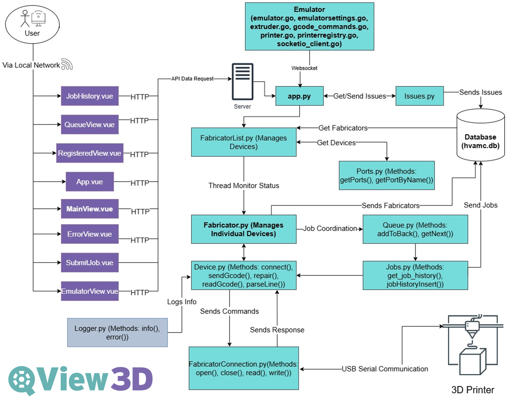

# QView3D

## Overview

QView3D, developed at SUNY's Hydra Lab, is an open-source software project designed to streamline the management and communication of 3D printing files to printer arrays. It offers users an expandable framework to enhance their workflow and take control of their process. Embracing an open community ethos, QView3D continuously evolves, actively seeking collaboration and feedback from users to improve and innovate.

The project is maintained by computer science students at SUNY New Paltz, under the guidance of Professor Michael Curry. Team members are responsible for the development, testing, and documentation of the software. The project is part of the Computer Science Department's capstone course, where students work on real-world projects to gain experience in software development.

## Lab Development Team

- [**Michael Curry**](https://github.com/currymike123)
- [**Lars Palombi**](https://github.com/Lars-Codes)
- [**Jack Gusler**](https://github.com/jackgusler)
- [**Olamide Kumapayi**](https://github.com/olakuma)
- [**Nathan Gopee**](https://github.com/ndg8743)
- [**Ari Yeger**](https://github.com/L10nhunter)
- [**CJ Jenks**](https://github.com/iron768)
- [**Stiviyan Dragiev**](https://github.com/dragiev1)
- [**Christopher Jamieson**](https://github.com/shift16)
- [**Youssup Song**](https://github.com/youssup)

## Features

- **Concurrent Communication**: Manage multiple 3D printers simultaneously.
- **Job Management**:
  - Local storage of database.
  - Load balancing to distribute jobs across multiple printers.
  - Storage management for purging old files while retaining essential data.
  - Job prioritization and favoring.
  - Comprehensive job filtering and history tracking.
  - Initiate printer pauses and filament color changes.
  - Supports various printer models.
- **Error Logging**: Assign comments and track issues for past jobs to analyze job success and error rates.
- **Advanced Viewing**:
  - Real-time 3D model previews before and during printing.
  - Layer-by-layer virtual print monitoring via GCode Viewer.
- **Virtual Printer Emulator**: A Go-based emulator to simulate printer behavior, enabling testing without physical hardware.
- **Cross-Platform Compatibility**: Runs on Windows, macOS, and Linux, ensuring accessibility across systems.

## Technologies

- **Frontend**: Vue.js with Bootstrap for styling.
- **Backend**: Flask integrated with SQLite, handling data through Node.js.
- **Communication**: Serial communication via PySerial.
- **Database**: SQLite.
- **Testing**: Virtual printer emulator built in Go for G-code simulation and testing.

## Architecture Diagram



## Setup and Installation

The software is currently designed to run on Ubuntu 20.04 LTS and later. MacOS and Windows are supported; but Windows compatibility is still being worked on, and works with npm run start.

Clone the repository:

```sh
git clone https://github.com/sunyhydralab/QView3D.git
```

Run the following commands to install dependencies and start the application:

```sh
cd QView3D
``` 

```sh
python run.py
```

## Pull Requests

We welcome contributions to QView3D. Please follow the guidelines in the [CONTRIBUTING.md](CONTRIBUTING.md) file.

## License

This project is licensed under the MIT License - see the [LICENSE.md](LICENSE.md) file for details.

## Version

1.0.0
